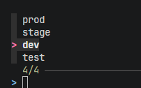
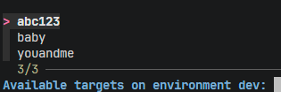

The best CLIs are the ones that hold my hand from beginning to end, but only if I need it.

## Level 1: Don't Print an Error, Print the Help

This is always an inauspicious start to using a new CLI:

```console
$ my_cli_entrypoint
error: missing required arguments, use the --help flag for instructions
```

If your CLI absolutely *requires* arguments, then at least print the `--help` flag by default when no arguments are provided.

```console
$ my_cli_entrypoint
usage: my_cli_entrypoint <environment> <target_id>
```

One thing to note: some processes really care about error codes. It's important to send that help output to `stderr` with a non-zero exit code.

## Level 2: Prompt (But Fail Loudly)

You can take this a step further and prompt the user for what they forgot:

```console
$ my_cli_entrypoint
Enter environment: test
Enter target_id: abc123
Processing...
```

This has the downside of hanging in CI and other non-interactive environments, so we must always expose a non-interactive entrypoint:

```console
$ my_cli_entrypoint test abc123
Processing...
```

The real finishing move here is to actually check if we're in a TTY and fail loudly if not:

```console
# locally
$ my_cli_entrypoint
Enter environment: ...

# in CI
$ my_cli_entrypoint
error: not a TTY
```

You can check this in Python with `sys.stdin.isatty()`:

```python
def prompt(text: str) -> str:
    if not sys.stdin.isatty():
        raise RuntimeError("Not in a TTY.")
    return input(text)
```

## Level 3: Enum Selection

In my quest to accomplish tasks in the fewest motions possible, I like to make these kinds of calls even more interactive. I'm a **heavy** user of [fzf](https://github.com/junegunn/fzf) and I'm all too happy to admit it. If your CLI requires an argument and the user doesn't provide it, why not help the user out with a helpful enum selection?



## Level 4: Dynamic Selection Based on Earlier Selections

Selecting from an enum is one thing. But taking this even further for the user and, if within reason for the dataset, allow dynamic selection of valid options based on prior selections:



I alluded to it already, but to state it plainly: there's a real cost if the query is slow. If it impacts your database or the latency is unacceptable, sometimes this isn't an option. Consider your individual use case.

## Level 5: Allow Re-Runs Without Repeating the Rigmarole

A nice finishing touch after holding the user's hand through selection of CLI arguments is to echo the full command back afterward. This way, should the user need to run the same command over and over (such as a deploy-and-test cycle) again, they only have to go through the multi-step interactive mode once:

```console
$ my_cli_entrypoint
# fzf enum prompt, user selects "dev"
# fzf dynamic prompt, user selects "abc123"
Processing...
Complete! Run again with:
  my_cli_entrypoint dev abc123

...

$ for iteration until bug_solved:
    $ my_cli_entrypoint dev abc123
Processing...
```

It's worth calling out when the advice *doesn't* apply: when it doesn't bring value. Is it more important for the users to learn the real flags than have their hands held? Will the only caller of the script be another script? Or an AI agent?

Again, consider your use cases–but also, consider your users and how using your CLI will be easiest for someone running it for the first time.

> Song On Right Now: "[ABC 123](https://song.link/s/7nNGtSokoA375V9yf6EELy)" by Tune-Yards
