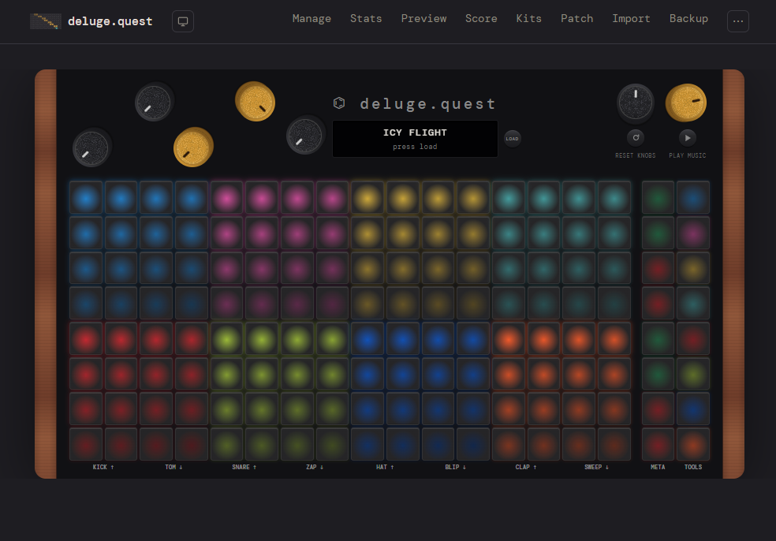
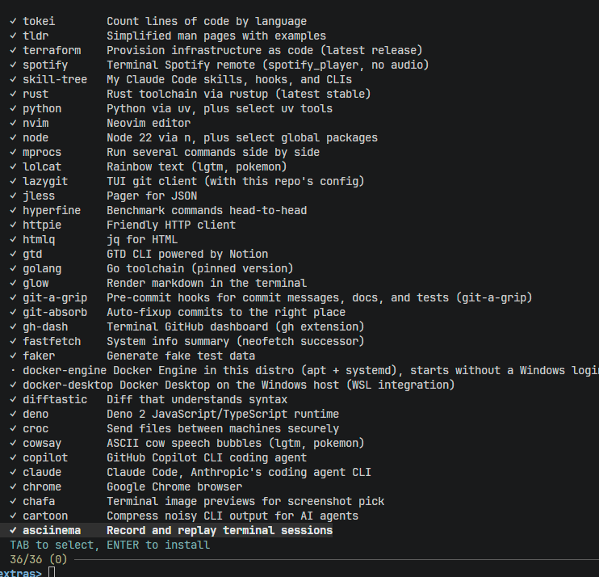

I do have a soft goal of blogging at least a month, and I'm really cutting this one close.
A quick trio of items I'm excited about.

## deluge.quest

For the last several weeks I've been working on [deluge.quest](https://deluge.quest), a website to help manage one's XML and audio files on the Synthstrom Deluge music workstation.

This turned into what is almost certainly the most complex frontend I've ever designed, including a semi-functional copy of the Deluge itself, animations, audio, a step sequencer using the user's own samples (or synth-generated 808 samples by default), recordings of dozens of songs I've made on the Deluge with effects one can apply via on-screen knows, and much more.

Truth be told, I've never liked React, as state management is just verbose and hard to grasp. I did a lot of jQuery back in the day, then during the battle for dominance between React, Angular, and Vue, I started shifting to backend and have just gone deeper in that direction. But as I've been doing more frotend work lately, I've been impressed with newer tools like Astro and Svelte. They work for deluge.quest in particular because there's minimal shared state between views -- it's a collection of individual tools not necessarily dependent on each other. That said, state management works just fine for caching user files and maintining audio across pages.

How far can one go in today's frontend world without using React? I'm going to find out. (Not really, React is core to my day job's core product so I'll still be using it.)

## Opus 5.5

Opus 5.5 came out last week and I'm kind of blown away. I had become pretty adamantly opposed to using
Opus 5, as the verbosity and jargon were out of control. I was still using Opus 4.6 for more heavy duty
task planning and orchestration, but delegating mechanical work down to Sonnet or sometimes Haiku for
token-saving reasons.

Since Opus 5.5 came out, I've been using it exclusively with mix of low/medium effort, and I'm having
an extremely hard time hitting any 5-hour windows. I'm pretty strictly using AI via a human-in-the-loop
approach, so this is in part a factor of how much time I'm putting in, but still -- if I had been using
Opus 4.6 at this level this week, I would have hit *many* five-hour-window lockouts. (I am aware that
Anthropic has also increased the 5-hour limit alongside this release.)

I'm keeping an eye out for flaws and Claudisms that I haven't caught onto yet, but early impressions
are *extremely* favorable. I've been considering trying out some other AI providers, but it will be
hard to justify that if I'm struggling to hit weekly limits. (I'm at 56% used and reset tonight, and
while it hasn't been my busiest week, I've still done a lot of work.)

## Dependency Management Upgrades in Dotfiles

I'm always tweaking my [dotfiles](https://github.com/dannybrown37/dotfiles), but I'm very happy with some
improvements I've made to my 'justfile' and dependency management in the last few weeks.

Previously, I'd have commands like `just git-tools`, `just rust-tools`, that collected tools by language
or domain. As I added more tooling to my utility belt, this got out of hand -- what goes where? What's grouped
with what? And why do I need *all* my Git tools installed when I just want that *one*?

I've split it up now: `just bootstrap` is the non-negotiable daily-driver stuff. Fully idempotent, so I
can always re-run and make sure I'm in sync.

`just extras`, on the other hand, gives me real-time environment auditing, fuzzy find against names and descriptions,
and multi-selection for quick install of any tools I deem worth documenting here:

This is a much more dynamic and ergonomic dependency management process that I'm quite enjoying.
