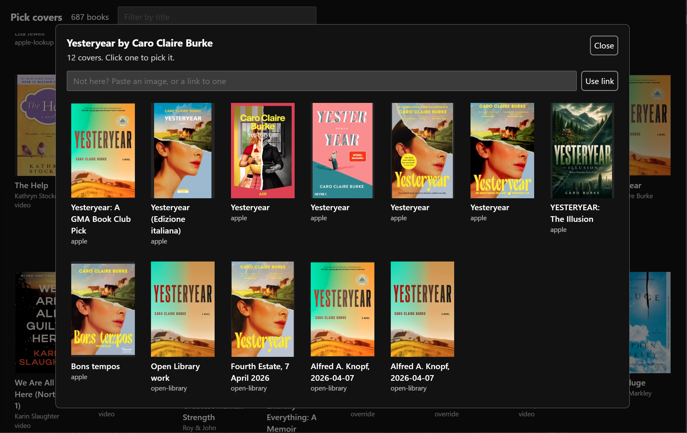

Paying for Claude Code is a non-starter if I don't use it, but sometimes I'm between major technical projects and struggling to use tokens in an actually useful way.

After more or less finishing [deluge.quest](https://deluge.quest) recently, looking for token-hungry projects is the state I've been in. I found out about the [Remotion](https://www.remotion.dev/) framework recently, and I felt like taking it for a spin.

I've been keeping a list of books I've read for years now, but it was in fairly rough shape:

1) Plenty of misspellings in my manually filled database
2) The only genres tracked were either fiction or non-fiction
3) No ratings
4) No images
5) Older year estimates were in bands rather than specific (12 and younger, 13-16, etc.)

I've read/listened to nearly 300 books in the last couple years, and I figured a video on books I read *could* be interesting (to me, at least), but it needed some opinions.

## Genre and Rating Backfill

I keep by books list in Notion. I've had some API integrations for years now to support iOS and CLI shortcuts, so I onboarded Claude Opus 5.5 to my existing tools, then put it to work on collecting genres for each book.

While it worked, I ranked all the books I've ever read. I defaulted to 3 stars for most books, especially the ones where my memory of details is fuzzy. If I remember being bored or confused, that was generally a 2-star rating. If I hated it or didn't finish it, that was (mostly) a 1-star rating, unless there was something redeemable to salvage a second star. On the positive end, books that I remember really loving got 4 stars, and it's hard to forget all-time favorites, which got 5 stars (reserved for less than 5% of ranked books).

Ratings complete, I took a look at what Claude was suggesting for genres. I quibbled and had it change some things, collapse a few into each other, and generally set up a system I liked. I had it push the changes up to Notion (backing up in multiple ways first). Then I filtered on each category and reviewed each book, changing where appropriate.

I've got to say I never would have done this exercise manually. I would have lived forever with a fiction/non-fiction split. This is where LLMs really thrive: in enhancing something one wants to do but won't, mainly due to time or motivation constraints.

```console
$ npm run genres

> shelf-life@1.0.0 genres
> node scripts/report-genres.ts

 126  Fantasy                 50 Children's, 5 Young adult
 113  Mystery & thriller      15 Children's
  74  Literary fiction        7 Children's, 3 Young adult
  67  Science fiction         2 Children's, 10 Young adult
  49  Biography & memoir
  41  Historical fiction      8 Children's, 3 Young adult
  32  Sports                  1 Children's
  27  Music
  27  Religion                1 Children's
  23  Self-help & psychology
  18  Plays & scripts         4 Children's, 1 Young adult
  16  Business & money
  15  Horror                  2 Young adult
  12  Humor                   4 Children's
  11  History
  11  Technology
   9  Politics & society
   6  Science & math
   4  Philosophy
   3  Romance
   3  Reference
   0  (none)
 687  total

```

## Image Retrieval and Cover Picking

The video would be pretty pointless without book images, so again I put Claude to work on pulling these down, first for just the books I've read in the last two years, but eventually for my lifetime list of books. It used a combo of the Open Library and Apple Books APIs to gather this data. I haven't worked around books on past software projects, so these are new to me, but I'm glad to incorporate them into my utility belt for future projects. I suspect this won't be the last time I work on something book-related.

Image collection complete, I set up a basic gallery to just view them all in order. I was a bit disgusted with what I saw. Hundreds of books, with covers unrecognizable to me. I think most book lovers will agree that they associate a particular cover image with most books they've read, and alternate images are mostly uncomfortable or outright offputting.

I asked Claude to build me an image picker, and boy, did it overperform:



Some books still didn't have an acceptable cover, so for the ones that really mattered (i.e., my 4- and 5-star books), I added an input box to paste an image directly in instead. At this point it was a lot of manual work off of memory to find the "correct" cover for my virtual bookshelf.

## API Goodies for iOS Shortcut

At this point, I had to step away from data cleanup and think of the future. Asking AI to annotate my data on an ongoing basis is unacceptable to me, and I'm certainly not going to collect images and other metadata by hand for every book.

My existing iOS Shortcut, that I've been using since well before LLMs came on the scene, was pretty brute force: it asked for title, author, notes, and date read, then sent all the collected info to Notion via a raw API request.

Now knowing about these two book APIs, I instead built a Flask app that asks for a book title, calls one or both APIs (fallback on fail) to find suggestions, then returns those to me. Once selected, all metadata is filled and it's just on me to add notes and a rating. Even the image is looked up and uploaded to Notion (although I probably need a cover picker integrated into the iOS shortcut long-term, which I haven't done yet).

I deployed this app and tested it, and the last two books I added worked near-flawlessly. (I did adjust the genre for one of them.)

## Fixing The Timeline

At this point, I wanted to build a virtual gallery of books by year, but that meant attributing one or more years to a book, rather than catchall `12 and younger`, `13-16`, and `17-19` categories.

I did a first pass. Some were so easy -- I remember where I was, what I was doing, a school classroom or workplace or vacation, etc. while I was reading -- to where it was pretty easy to assign a year with 99% certainty. Others were more of a guess.

After this first pass, I asked Claude to sanity check my values. It called out a number of books I estimated to have read before their release date, and I adjusted those accordingly.

The hardest ones were my earliest books when I was in early grade school. I called my mom to help me figure out a rough timeline and order of these. She was both a teacher and my biggest supplier of books for a long time, so her help was invaluable to laying out a timeline on these old ones. Thanks, Mom!

## Results

Now I have a new Easter Egg on my site: [a virtual bookshelf](https://books.dannybrown.dev/) that works just the way I want it to. And if I want it to work differently later, I can just change it! How great.

One other thing: I threw together a [short song](https://deluge.quest/songs/shelf-life) on my Synthstrom Deluge as backing music -- who wants a silent video?

I'm no Spielberg, but I feel like this was a pretty decent first effort using Remotion. Enjoy!

<video controls playsinline preload="metadata" class="w-full rounded-lg">
    <source src="/videos/audiobook-renaissance.mp4" type="video/mp4" />
</video>
